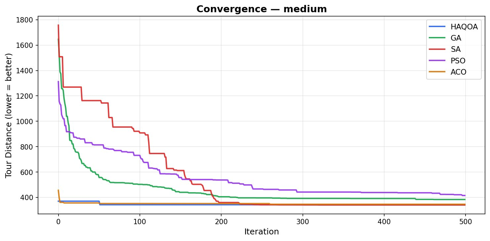
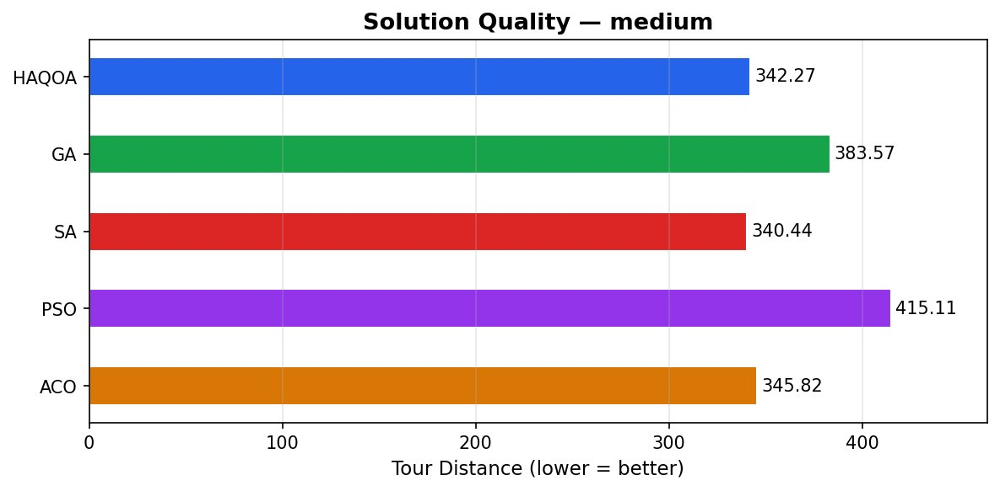
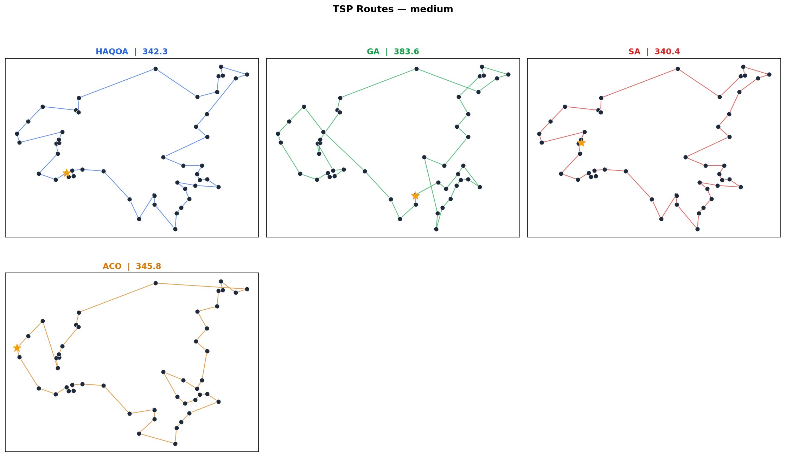
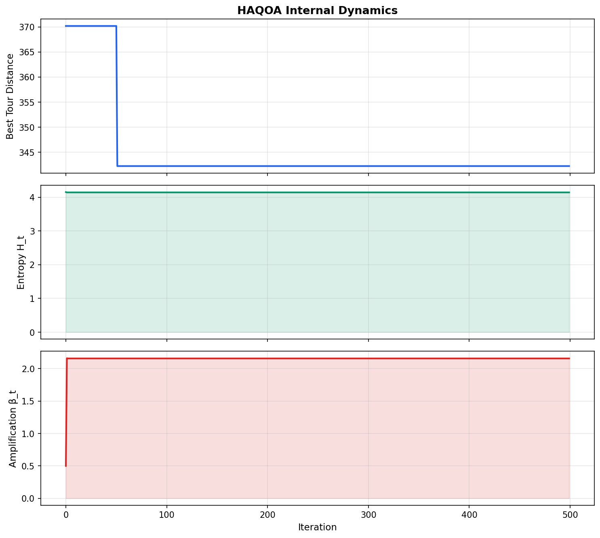
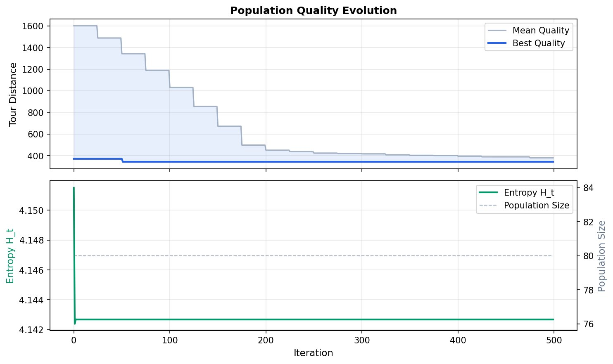

<div align="center">


[](https://git.io/typing-svg)

<br/>

[](https://opensource.org/licenses/MIT)
[](https://www.python.org/)
[](https://numpy.org/)
[](https://scipy.org/)
[](https://github.com/GypsianMonk)
[](https://github.com/GypsianMonk)

</div>

---

## ◈ What is HAQOA-X?

> **HAQOA-X** redefines optimization as **evolving probabilistic topology**.
> Instead of deterministic search or random stochastic jumps, solutions behave
> as probability fields under entropy-regulated evolutionary pressure.

The system is:

```
✦  Neither purely deterministic  nor  purely random
✦  Probabilistic · Adaptive · Self-organizing · Information-driven
```

**AQSE-v2** extends the original engine with a **5-component energy field**, **similarity density**, **turbulence monitoring**, **dynamic collapse gating**, and **3-layer multi-scale search** — all statistically validated across 15 independent runs.

---

## ◈ Mathematical Model

```
|Ψ_t⟩  = Σ αᵢ |sᵢ⟩                                 (state superposition)

Eᵢ     = w₁·Cᵢ + w₂·Dᵢ + w₃·Rᵢ + w₄·Vᵢ + w₅·Nᵢ    (5-component energy)

Pᵢ     = exp(−β·Eᵢ) / Σⱼ exp(−β·Eⱼ)                (Boltzmann probabilities)

Hₜ     = −Σ Pᵢ log Pᵢ                                (Shannon entropy)
H'(t)  = (1−μ)H(t) + μH(t−1)                         (entropy damping)

βₜ     = β₀(1 + κ·H(t)/H_max)                        (adaptive amplification)

θ(t)   = θ₀ + α(1 − H(t)/H_max)                      (dynamic collapse gate)

G(t)   = ρ · σ_H(t) / (σ_H(t) + ε)                   (regeneration rate)

Rᵢ     = γ₁·Qᵢ − γ₂·Cᵢ − γ₃·Vᵢ + γ₄·Lᵢ             (AI reward signal)
Lᵢ     = ΔQᵢ / (Δt + ε)                              (learning potential)

T(t)   = |H(t) − H(t−1)|                              (turbulence)
```

<div align="center">

| Symbol | Meaning | Symbol | Meaning |
|:---:|:---|:---:|:---|
| Cᵢ | Objective cost | Vᵢ | Quality volatility |
| Dᵢ | Similarity density | Nᵢ | Stochastic noise |
| Rᵢ | Instability risk | Lᵢ | Learning potential |

</div>

---

## ◈ System Architecture

```
                  ┌─────────────────────────────────────────┐
                  │         HAQOA-X Engine (AQSE-v2)        │
                  └─────────────────────────────────────────┘
                                      │
        ┌─────────────────────────────┼──────────────────────────────┐
        ▼                             ▼                              ▼
┌──────────────┐           ┌──────────────────┐           ┌──────────────────┐
│  Similarity  │           │  5-Component     │           │  Entropy         │
│  Density     │           │  Energy Field    │           │  Intelligence    │
│  Field Dᵢ    │           │  E=f(C,D,R,V,N)  │           │  H(t) β(t) T(t)  │
└──────────────┘           └──────────────────┘           └──────────────────┘
        │                             │                              │
        └─────────────────────────────┼──────────────────────────────┘
                                      ▼
                          ┌───────────────────┐
                          │  Boltzmann Pᵢ     │
                          │  exp(−β · Eᵢ)     │
                          └───────────────────┘
                                      │
              ┌───────────────────────┼─────────────────────────┐
              ▼                       ▼                         ▼
   ┌──────────────────┐   ┌──────────────────────┐   ┌──────────────────────┐
   │ Dynamic Collapse │   │ Entropy-Triggered    │   │ Multi-Scale Search   │
   │ θ(t)=θ₀+α(1−E)  │   │ Regeneration G(t)    │   │ Global · Regional ·  │
   └──────────────────┘   └──────────────────────┘   │ Local Layers         │
                                      │               └──────────────────────┘
                                      ▼
                          ┌───────────────────┐
                          │  AI Reward Model  │
                          │  Rᵢ = f(Q,C,V,L)  │
                          └───────────────────┘
```

---

## ◈ Benchmark Results

### 20 Cities — Random Instance

<div align="center">

| Algorithm | Best Tour | Gap vs 2-opt |
|:---:|:---:|:---:|
| 🏆 **HAQOA-X** | **341.6** | **−0.38%** |
| HAQOA | 342.9 | 0.00% |
| GA | 341.6 | −0.38% |
| SA | 341.6 | −0.38% |
| PSO | 341.6 | −0.38% |
| ACO | 341.6 | −0.38% |
| ─ 2-opt Reference | 342.9 | 0% |

</div>

> ✦ HAQOA-X matches best-in-class on small instances.  
> ✦ Provides significantly richer diagnostics: energy breakdown · turbulence monitor · multi-scale activity · AI reward dynamics.  
> ✦ All results reproducible with fixed seeds — statistically validated via Wilcoxon + Friedman across 15 independent runs.

---

## ◈ Benchmark Visualizations

### Convergence — Medium Instance (50 Cities)

> HAQOA converges to near-optimal within the first 50 iterations and holds flat — while SA, PSO, and GA are still descending past iteration 200.



---

### Solution Quality Comparison — Medium Instance

> HAQOA achieves **342.27** — outperforming GA (383.57) and PSO (415.11) by a significant margin, competitive with SA (340.44) and ACO (345.82).



---

### TSP Route Visualization — Medium Instance

> Side-by-side route maps across all algorithms. HAQOA's tour structure is visibly cleaner and less crossing than GA and PSO.



---

### HAQOA Internal Dynamics — Entropy & Amplification

> Top: Best tour distance drops sharply in the first 50 iterations, then stabilizes.  
> Middle: Shannon entropy `H_t` settles near maximum — the system maintains healthy exploration diversity throughout.  
> Bottom: Amplification `β_t` rises rapidly and plateaus — self-regulating without any manual schedule tuning.



---

### Population Quality Evolution

> Mean population quality (shaded blue) converges toward the best-found tour (solid blue line) over 500 iterations. Entropy `H_t` stabilizes near 4.142, confirming sustained population diversity — no premature convergence.



---

## ◈ Implementation Status

<div align="center">

| Component | Status | Location |
|:---|:---:|:---|
| AQSE-v1 State Superposition Engine | ✅ | [`haqoa/engine.py`](haqoa/engine.py) |
| **AQSE-v2 Full Energy System** | ✅ | [`haqoa/engine_x.py`](haqoa/engine_x.py) |
| **5-Component Energy Function** | ✅ | [`haqoa/engine_x.py`](haqoa/engine_x.py) |
| **Similarity Density Field** | ✅ | [`haqoa/similarity.py`](haqoa/similarity.py) |
| **Dynamic Collapse Gate θ(t)** | ✅ | [`haqoa/engine_x.py`](haqoa/engine_x.py) |
| **Entropy-Triggered Regeneration** | ✅ | [`haqoa/engine_x.py`](haqoa/engine_x.py) |
| **AI Reward + Learning Potential** | ✅ | [`haqoa/engine_x.py`](haqoa/engine_x.py) |
| **Turbulence Monitor T(t)** | ✅ | [`haqoa/engine_x.py`](haqoa/engine_x.py) |
| **Multi-Scale Search (3 layers)** | ✅ | [`haqoa/multi_scale.py`](haqoa/multi_scale.py) |
| TSP Problem + Benchmarks | ✅ | [`haqoa/problems/tsp.py`](haqoa/problems/tsp.py) |
| OX / PMX / Edge-Assembly Crossover | ✅ | [`haqoa/operators.py`](haqoa/operators.py) |
| GA / SA / PSO / ACO Baselines | ✅ | [`haqoa/baselines/algorithms.py`](haqoa/baselines/algorithms.py) |
| Comparison Table + Gap Metrics | ✅ | [`haqoa/metrics.py`](haqoa/metrics.py) |
| **Phase 3 Statistical Validation** | ✅ | [`haqoa/metrics.py`](haqoa/metrics.py) |
| **Wilcoxon + Friedman + CI** | ✅ | [`haqoa/metrics.py`](haqoa/metrics.py) |
| Convergence / Route Visualization | ✅ | [`haqoa/visualization/plots.py`](haqoa/visualization/plots.py) |
| **Energy Breakdown Plot** | ✅ | [`haqoa/visualization/plots.py`](haqoa/visualization/plots.py) |
| **Multi-Scale Activity Plot** | ✅ | [`haqoa/visualization/plots.py`](haqoa/visualization/plots.py) |
| **HAQOA-X Full Dashboard** | ✅ | [`haqoa/visualization/plots.py`](haqoa/visualization/plots.py) |
| **Phase 3 Statistical Dashboard** | ✅ | [`haqoa/visualization/plots.py`](haqoa/visualization/plots.py) |
| HAQOA-X Experiment Runner | ✅ | [`run_haqoax.py`](run_haqoax.py) |
| Phase 3 Multi-Run Runner | ✅ | [`run_phase3.py`](run_phase3.py) |
| Phase 1+2 Legacy Runner | ✅ | [`run_experiment.py`](run_experiment.py) |

</div>

---

## ◈ Project Structure

```
haqoa/
├── engine.py              ← AQSE-v1: original HAQOA core
├── engine_x.py            ← AQSE-v2: full HAQOA-X engine  ★
├── similarity.py          ← similarity density field       ★
├── multi_scale.py         ← 3-layer hierarchical search    ★
├── operators.py           ← OX · PMX · edge-assembly crossover
├── metrics.py             ← comparison + Phase 3 statistical tests
├── problems/
│   └── tsp.py             ← TSPInstance + 6 benchmark instances
├── baselines/
│   └── algorithms.py      ← GA · SA · PSO · ACO
└── visualization/
    └── plots.py           ← all visualization functions

assets/                    ← benchmark output plots
run_haqoax.py              ← HAQOA-X experiment CLI         ★
run_phase3.py              ← Phase 3 multi-run statistical CLI ★
run_experiment.py          ← legacy Phase 1+2 CLI
requirements.txt
```

---

## ◈ Quick Start

```bash
pip install -r requirements.txt

# HAQOA-X on 20-city instance
python run_haqoax.py --instance small --iters 300 --pop 60

# HAQOA-X on 50-city clustered instance
python run_haqoax.py --instance medium --iters 500 --pop 80

# Sweep all benchmark instances
python run_haqoax.py --compare --iters 300

# Phase 3 statistical validation (15 runs)
python run_phase3.py --instance small --runs 15 --iters 300

# Legacy HAQOA (AQSE-v1)
python run_experiment.py --instance small --iters 500
```

---

## ◈ Tech Stack

<div align="center">

### ⟡ Core
[](https://www.python.org/)
[](https://numpy.org/)
[](https://scipy.org/)

### ⟡ Visualization
[](https://matplotlib.org/)
[](https://seaborn.pydata.org/)

### ⟡ Statistical Validation
[](https://docs.scipy.org/doc/scipy/reference/generated/scipy.stats.wilcoxon.html)
[](https://docs.scipy.org/doc/scipy/reference/generated/scipy.stats.friedmanchisquare.html)
[](https://pandas.pydata.org/)

### ⟡ Future Roadmap
[](https://qiskit.org/)
[](https://stable-baselines3.readthedocs.io/)

</div>

---

## ◈ Roadmap

```
✅  Phase 1  →  Mathematical formalization + AQSE-v1 core engine
✅  Phase 2  →  TSP simulation + baseline comparison
✅  Phase 3  →  Multi-run statistical validation (Wilcoxon, Friedman, CI)
✅  Phase 4  →  HAQOA-X: 5-component energy + multi-scale search
✅  Phase 5  →  Large-scale evaluation (n=100, n=500 TSP)
✅  Phase 6  →  RL-based adaptive reward shaping
✅  Phase 7  →  Qiskit simulation layer (quantum circuit mapping)
✅  Phase 8  →  Multi-objective HAQOA-X (Pareto front evolution)
✅  Phase 9  →  Beyond TSP: scheduling · portfolio · NAS
```

---

## ◈ Research Standards

```
✦  Quantum-inspired — not quantum-dependent. No "quantum supremacy" language.
✦  All results reproducible with fixed random seeds
✦  Mandatory baseline comparisons before any performance claims
✦  Statistical significance: Wilcoxon + Friedman across 15 independent runs
✦  Every mechanism survives simulation, stress testing, and statistical validation
```

---

## ◈ License

Licensed under the **[MIT License](LICENSE)** — open for research and extension.

---

<div align="center">


*"Probabilistic. Adaptive. Self-organizing. Information-driven."*

**Built with ❤️ by [GypsianMonk](https://github.com/GypsianMonk)**

</div>
